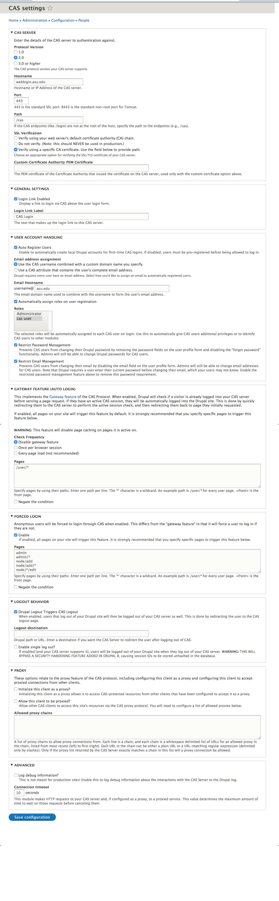

## ASU Brand module for Drupal 8

### Installation Instructions
1. Install and enable the ASU Brand module just like any other module.
2. Go to the Admin -> Structure -> Blocks and place the ASU Brand header and ASU Brand
   footer blocks into the header and footer regions respectively. The available
   regions will be determined by the theme that you are using.
3. The header and footer are automatically be cached as long as the Internal Dynamic Page Cache
   locally core module is enabled. If you need to manually refresh them, go to
   Admin -> Configuration -> Performance and clear the site's cache.

### CAS Integration
Install and enable the CAS module to allow users to create accounts and authenticate
to your site via CAS.

### CAS Configuration
Use the following as your CAS configuration:

 
